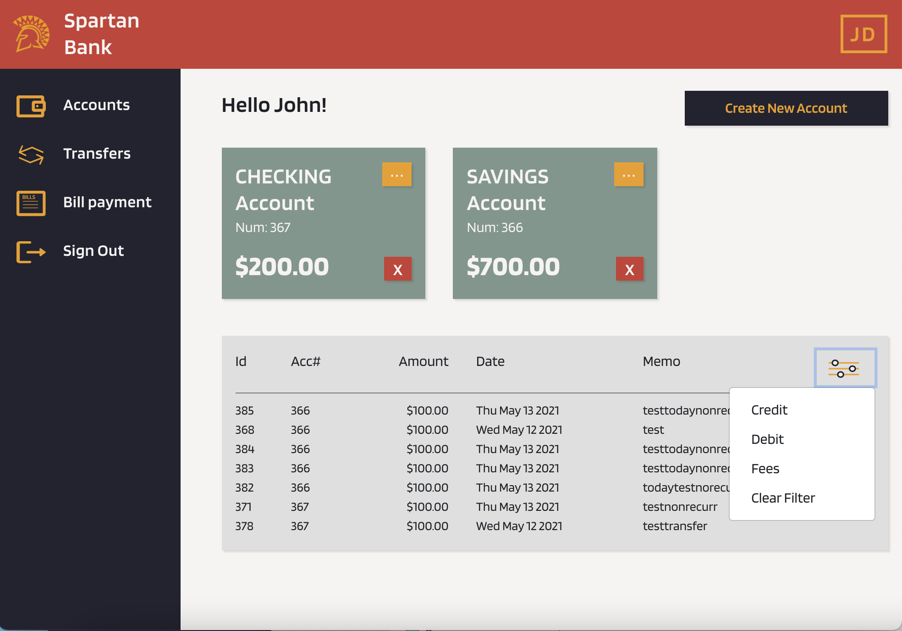
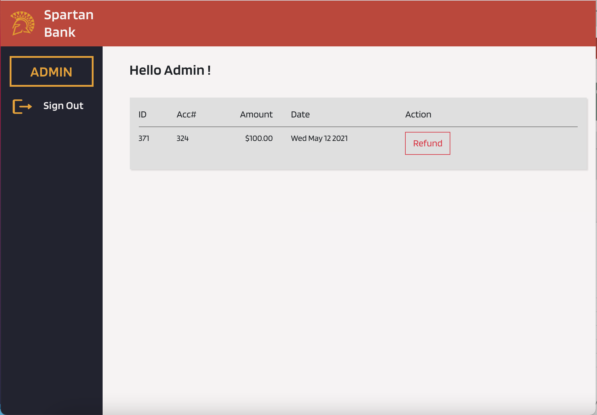

# team-project-techno-spartan
## University : [San Jose State University](http://www.sjsu.edu/)
## Course: Software Systems Engineering
## Professor: Gopinath Vinodh

## Team : Techno Spartan
Student Name      | 
-------------     |
Anastasia Zimina |
Parvathi Pai     |
Shreya Ghotankar  |
Sania Gonsalves |

### Application Use Case:
Online Banking system (that can be accessed through Web/Mobile).
Design and implement supporting APIs for a banking system including a Database of your choice to persist Customer data.

### Architecture Diagrams

### Weekly Scrum Report and XP Core Values -
* [Week 1](Documentation/ScrumReports/2021-03-14WeeklyScrumReport.pdf)
* [Week 2](Documentation/ScrumReports/2021-04-02WeeklyScrumReport.pdf)
* [Week 3](Documentation/ScrumReports/2021-04-07WeeklyScrumReport.pdf)
* [Week 4](Documentation/ScrumReports/2021-04-15WeeklyScrumReport.pdf)
* [Week 5](Documentation/ScrumReports/2021-04-25WeeklyScrumReport.pdf)
* [Week 7](Documentation/ScrumReports/2021-05-02WeeklyScrumReportpdf.pdf)
* [Week 7](Documentation/ScrumReports/2021-05-09WeeklyScrumReport.pdf)

### Burndown Charts - 
* [Sprint 1](Documentation/ScrumReports/Burndown-Sprint1.png)
* [Sprint 2](Documentation/ScrumReports/Burndown-Sprint2.png)
* [Sprint 3](Documentation/ScrumReports/Burndown-Sprint3.png)
* [Sprint 4](Documentation/ScrumReports/Burndown-Sprint4.png)

### UI Wireframes

###  Authentication

Cognito user pool

EBS configurations

Docker images

Loadbalancers

EBS EC2 Configuration

