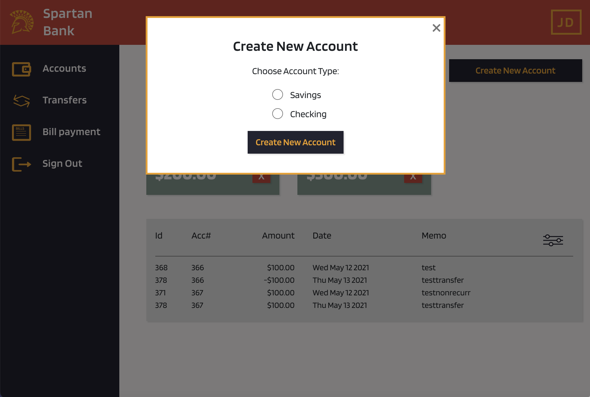

# team-project-techno-spartan
## University : [San Jose State University](http://www.sjsu.edu/)
## Course: Software Systems Engineering
## Professor: Gopinath Vinodh

## Team : Techno Spartan
Student Name      | 
-------------     |
Anastasia Zimina |
Parvathi Pai     |
Shreya Ghotankar  |
Sania Gonsalves |

### Application Use Case:
Online Banking system (that can be accessed through Web/Mobile).
Design and implement supporting APIs for a banking system including a Database of your choice to persist Customer data.

### Architecture Diagrams

### Weekly Scrum Report and XP Core Values - [Link](https://github.com/gopinathsjsu/team-project-techno-spartan/blob/BillPayment/Documentation/ScrumReports/)

### UI Wireframes

